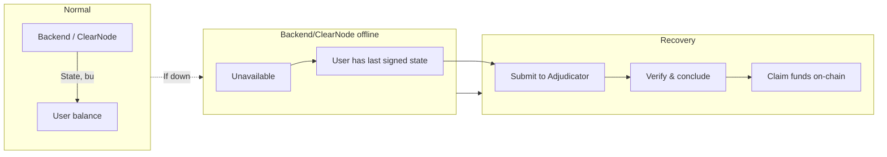

# Flywheel — Architecture & Flow Diagrams

This document contains high-level architecture diagrams. **All sequence flows (delegate, fulfill intents, send, withdraw, LiFi fallback) are defined in [`.context/sequence-diagrams.md`](.context/sequence-diagrams.md), which is the source of truth.**

---

## 1. High-Level System Architecture

```mermaid
flowchart TB
    subgraph User["User"]
        Wallet[Wallet / EOA]
    end

    subgraph Frontend["Flywheel Wallet (App)"]
        UI[Flywheel App]
        UI --> Delegation[Delegate & Session Key]
        UI --> Balance[Unified Balance]
        UI --> Send[Send / Withdraw]
    end

    subgraph Microservices["Microservices"]
        LIFRUST[lif-rust\nLiFi REST API]
    end

    subgraph External["External"]
        LIFIAPI[LiFi API\nPhase 2 or mocked]
    end

    subgraph Backend["Backend"]
        CN[ClearNode\nNitrolite RPC/WS]
        KMS[KMS\nSession Keys]
        Solver[Flywheel Solver]
    end

    subgraph Contracts["On-Chain"]
        Custody[Custody\nNitrolite]
        Adj[Adjudicator\nERC-7824]
    end

    subgraph Pool["Aggregated Liquidity"]
        PoolLP[LP (User assets)]
        Treasury[Flywheel Treasury]
    end

    Wallet <-->|Connect & EIP-712 Session Key| UI
    UI <-->|Real-time balance, progress| CN
    UI -->|REST: quote, calldata| LIFRUST
    Solver -->|REST: intent build| LIFRUST
    LIFRUST -->|HTTPS| LIFIAPI
    Backend <-->|State updates, co-sign| Custody
    Solver -->|Fulfill intents| PoolLP
    Solver -->|Use when needed| Treasury
    Custody --> Adj
```

---

## 2. Session Key & Delegation (Concept)

*Detailed flow: see [sequence-diagrams.md — §1 User Delegates Assets](.context/sequence-diagrams.md).*

- User connects wallet; App shows “Delegate to Pool” and “Allow Flywheel Solver to fulfill intents?” (Session Key).
- User signs once (EIP-712); Session Key registered with ClearNode (application, allowances, expires_at).
- Solver can fulfill intents without further wallet prompts (app-scoped).

---

## 3. Failure Mode & Recovery (Adjudicator)



---

*For all transfer and fulfillment flows (pool fulfill, LiFi when pool cannot fulfill, Treasury-sponsored, rewards 50/50), see [`.context/sequence-diagrams.md`](.context/sequence-diagrams.md).*
