# UXWallet — Architecture & Flow Diagrams

This document contains Mermaid diagrams for the UXWallet system. They are aligned with `.context/project-context.md` and `frontend/docs/uxwallet-frontend-prd.md`.

---

## 1. High-Level System Architecture

---

## 2. The Session Key & Delegation Flow

---

## 3. "The Happy Path": Cross-Chain Intent Fulfillment

```mermaid
sequenceDiagram
    participant U as User
    participant F as Frontend
    participant LIFI as "LI.FI (ERC-7683)"
    participant Chains as "Chains (e.g. Base, Ethereum)"
    participant V as "UXVault(s)"
    participant N as Nitrolite
    participant CN as ClearNode

    U->>F: "Unify (e.g. dust from Base + Ethereum)"
    F->>F: "Build intent (sources, assets, amounts)"
    F->>LIFI: Submit intent via SDK

    LIFI->>Chains: Route & execute cross-chain
    Chains->>V: Assets arrive at protocol vaults

    Note over V: Execution Guard: release only on atomic arrival / owner withdrawal

    V->>N: "State update (claims / liability)"
    N->>N: Co-sign with user Session Key
    N->>CN: Notify new state / balance

    CN->>F: "WebSocket (bu) — balance updated"
    F->>F: Update Unified Balance UI
    F->>U: Show success + updated balance
```

---

## 4. The "Execution Guard" Logic (Flowchart)

---

## 5. Failure Mode & Recovery (The Adjudicator)

---

*Diagrams are in Mermaid; render in GitHub, GitLab, or any Mermaid-capable viewer.*
