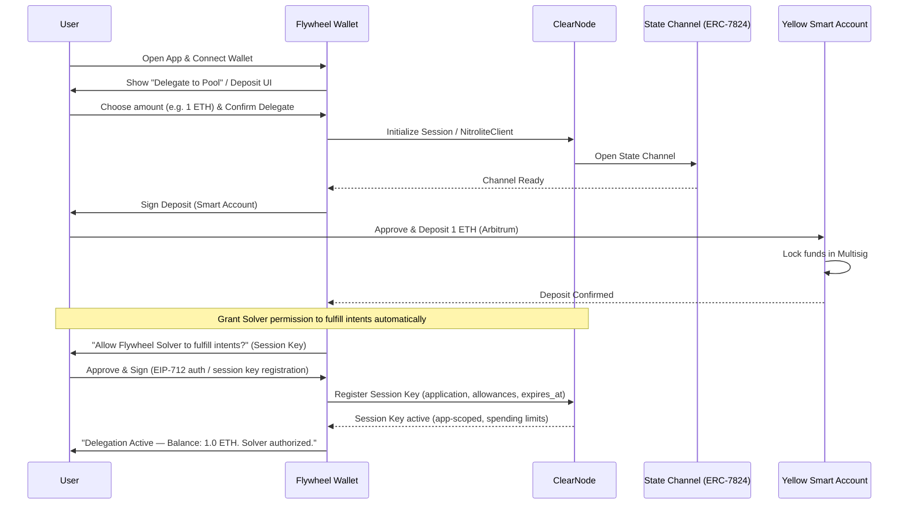
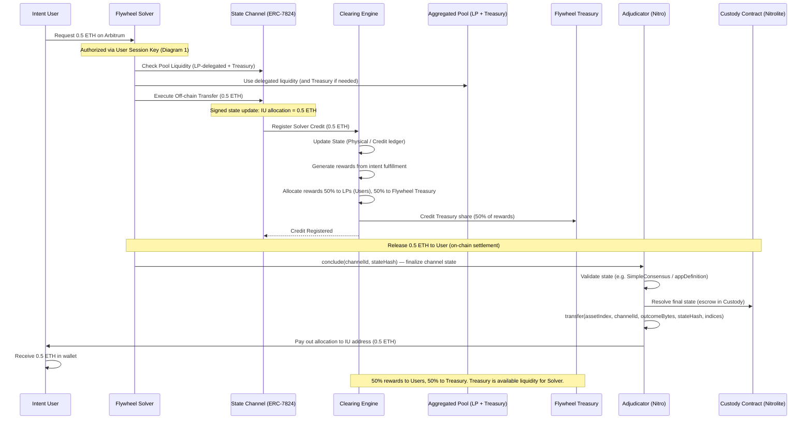
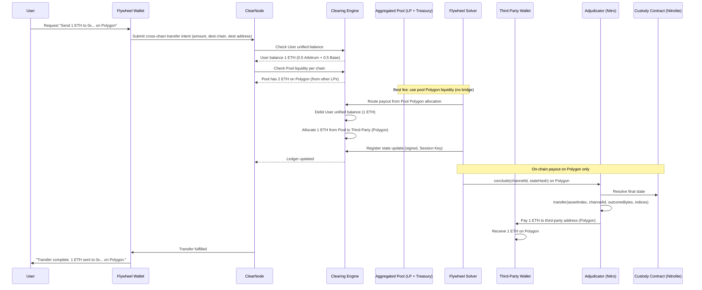
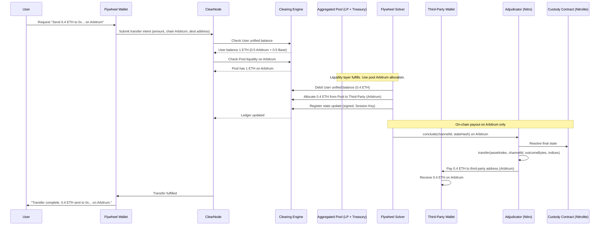
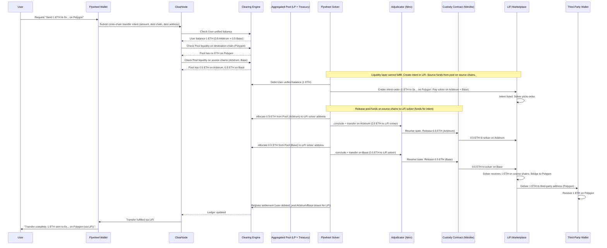
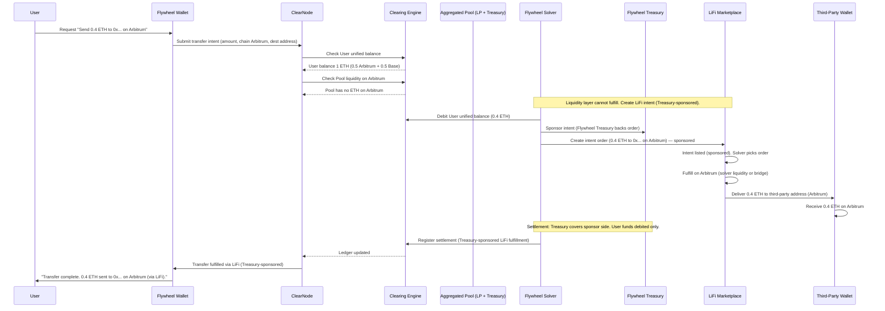
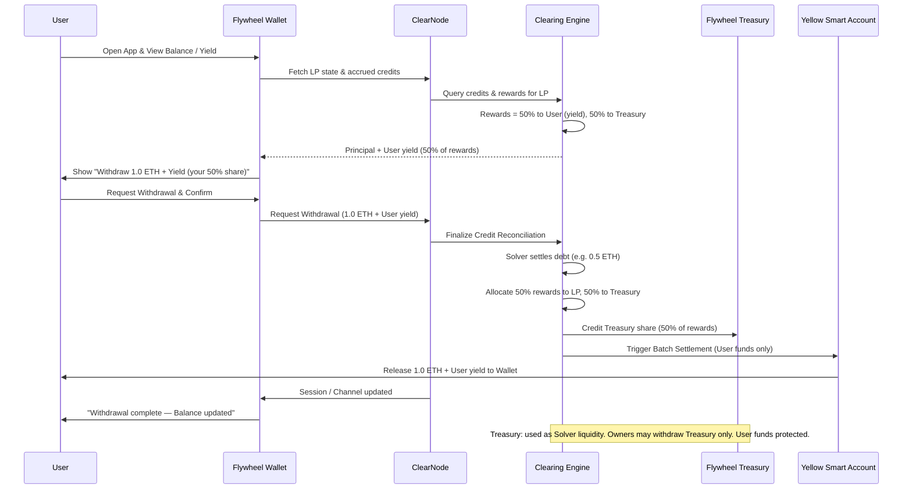

# **Sequence Diagrams: Flywheel — Aggregated Liquidity Pool**

These workflows describe how a **User** uses the Flywheel Wallet to delegate assets to the aggregated pool. The user only interacts with the App to delegate and **grants the Flywheel Solver permission** (via a Session Key) to fulfill intents automatically; the Solver then registers credits and distributes rewards without further user signatures.

**Rewards & Flywheel Treasury:** Intent order fulfillment generates **rewards**. The system distributes them **50% to the User** (LPs) and **50% to the Flywheel Treasury**. The Treasury is part of the **available liquidity** the Solver can use to fulfill intents (together with user-delegated assets). System owners may withdraw Treasury funds; **User funds are always protected** and never used for owner withdrawals.

---

## **1. User Delegates Assets (Deposit & Channel Setup)**

The user interacts with the App to delegate assets only and grants the Flywheel Solver permission to fulfill intents automatically via a **Session Key** (Yellow). The App and infrastructure set up the channel and lock funds.

**Why Session Key (not App Session):** Per Yellow/Nitrolite docs, **Session Keys** let the user **sign once** and grant the app (and thus the Flywheel Solver) limited, app-scoped access with **allowances** and **expires_at**, so the Solver can fulfill intents automatically without a wallet prompt each time. **App Sessions** are for multi-party state (e.g. escrow, DAO) with quorum and weights—they require coordinated signatures for state updates and are not aimed at “user delegates to solver once, solver acts many times.”

---

## **2. Flywheel Solver Fulfills Intents & Registers Credits (Automatic)**

No user action. The Flywheel Solver uses the user-granted **Session Key** and the aggregated pool (LP-delegated assets **and** Flywheel Treasury liquidity) to fulfill external intents, register credits, and allocate rewards (50% User, 50% Treasury). Releasing funds to the Intent User uses the Nitrolite Custody Contract and Adjudicator (ERC-7824) for on-chain settlement.

**Release to user (Yellow/Nitrolite):** The Flywheel Solver finalizes the channel state on-chain via the **Adjudicator** (`conclude`). The **Custody Contract** (Nitrolite) holds the escrow; the Adjudicator’s `transfer(assetIndex, channelId, outcomeBytes, stateHash, indices)` pays out the Intent User’s allocation. Alternatively, `concludeAndTransferAllAssets` can finalize and transfer in one transaction (ERC-7824).

---

## **3. User Cross-Chain Transfer to Third-Party (Unified Liquidity)**

The user sends funds to a **third-party wallet on another chain** using their **unified balance** (e.g. 0.5 ETH from Arbitrum + 0.5 ETH from Base). The **Aggregated Liquidity Pool** (user-delegated assets + Flywheel Treasury) provides liquidity on the destination chain (e.g. 2 ETH on Polygon from other users and/or Treasury), so the payout is fulfilled from the pool on the target chain—**no bridge** from the user’s source chains. This yields the **best fee rates** because the transfer is settled off-chain in the ledger and only one on-chain payout (pool → third party) on the destination chain.

**Example:** User has 1 ETH unified (0.5 Arbitrum, 0.5 Base); requests send 1 ETH to a wallet on Polygon. Pool has 2 ETH on Polygon (from other LPs and/or Treasury). Solver debits user’s unified balance and uses pool’s Polygon liquidity to pay the third party.

**Why best fee:** The user’s 1 ETH stays “in the system” (unified balance debited off-chain). The third party is paid from the pool’s **existing** Polygon liquidity, so there is no cross-chain bridge from Arbitrum or Base to Polygon for this transfer—only a single on-chain payout on Polygon.

---

## **4. User Same-Chain Transfer to Third-Party (Liquidity Layer Fulfills)**

The user sends a payment to a **third-party on the same chain** they have balance on (e.g. deposited from Arbitrum), and the **Aggregated Liquidity Pool has liquidity on that chain**. The liquidity layer **fulfills** the transfer: user’s unified balance is debited, and the pool pays the third party from its allocation on that chain. No bridge and no LiFi—best fee.

**Example:** User has 1 ETH unified (0.5 ETH from Arbitrum, 0.5 ETH from Base); requests send **0.4 ETH** to a third-party wallet **on Arbitrum**. The pool has **1 ETH on Arbitrum** at that time. Solver debits user’s unified balance and uses pool’s Arbitrum liquidity to pay the third party.

**When this path is used:** The user sends to a third-party **on a chain they have balance on**, and the pool **has liquidity on that chain**. The transfer is fulfilled from the pool on that chain; one on-chain payout, no LiFi, best fee.

---

## **5. User Cross-Chain Transfer to Third-Party (via LiFi Intent — Pool Cannot Fulfill)**

When the **liquidity layer cannot fulfill** (the Aggregated Liquidity Pool has **no** funds on the destination chain), the system **creates an intent order in the LiFi marketplace**. To complete the order, the system **sources funds from the pool on source chains** (where the user’s balance is allocated, e.g. Arbitrum and Base): those funds are released to the LiFi solver on the source chain(s); the solver then delivers the requested amount on the destination chain (Polygon) to the third party. The user’s unified balance is debited; the pool on Arbitrum/Base is drawn to pay the LiFi solver.

**Example:** User has 1 ETH unified (0.5 Arbitrum, 0.5 Base); requests send 1 ETH to a wallet on Polygon. The pool has **no ETH on Polygon** but has liquidity on Arbitrum and Base. System creates a LiFi intent; **releases 0.5 ETH from Pool (Arbitrum) and 0.5 ETH from Pool (Base)** to the LiFi solver; solver delivers 1 ETH to the third party on Polygon.

**Source of funds for LiFi:** The system takes the **1 ETH needed for the intent from the Aggregated Liquidity Pool on the source chains** where the user’s balance sits (e.g. 0.5 ETH from pool on Arbitrum, 0.5 ETH from pool on Base). Those amounts are released on-chain to the **LiFi solver** (via Custody/Adjudicator on each chain). The solver then bridges or swaps to deliver 1 ETH on Polygon to the third party. User’s unified balance is debited so the ledger stays consistent; the actual outbound movement is pool → LiFi solver on source chains → third party on destination.

**When this path is used:** The pool has insufficient (or zero) liquidity on the **destination** chain. The system uses the **LiFi marketplace** and funds the intent by **releasing pool liquidity on source chains** (Arbitrum, Base) to the LiFi solver, which completes the cross-chain delivery to the third party.

---

## **6. User Same-Chain Transfer to Third-Party (via LiFi — Treasury-Sponsored)**

The user sends a payment to a **third-party on a chain where the user has balance** (e.g. they deposited from that chain), but the **Aggregated Liquidity Pool has no funds on that chain** at that time. The liquidity layer cannot fulfill, so the system **creates an intent order in the LiFi marketplace**, **sponsored by the Flywheel Treasury**. The Treasury backs the order so the user’s transfer is fulfilled (e.g. a LiFi solver delivers to the third-party on that chain); the user’s unified balance is debited.

**Example:** User has 1 ETH unified (0.5 ETH from Arbitrum, 0.5 ETH from Base); requests send **0.4 ETH** to a third-party wallet **on Arbitrum**. The pool has **no ETH on Arbitrum** at that time. System creates a LiFi intent (0.4 ETH to 0x… on Arbitrum), **sponsored by Flywheel Treasury**; a LiFi solver fulfills it; third party receives 0.4 ETH on Arbitrum.

**When this path is used:** The user sends to a third-party **on a chain they have balance on**, but the pool has **no liquidity on that chain**. The system uses the **LiFi marketplace** with the intent **sponsored by the Flywheel Treasury** so the transfer is fulfilled; the user’s balance is debited and Treasury backs the order (user funds remain protected).

---

## **7. User Withdrawal & Reward Distribution**

The user interacts with the App to withdraw and claim. The Solver’s registered credits are reconciled; **rewards from intent fulfillment** are split **50% to the User** (yield) and **50% to the Flywheel Treasury**. The user receives principal plus their 50% share of rewards. Treasury funds can be used by the system as liquidity for the Solver; system owners may withdraw from the Treasury—**User funds are always protected** and never used for owner withdrawals.

