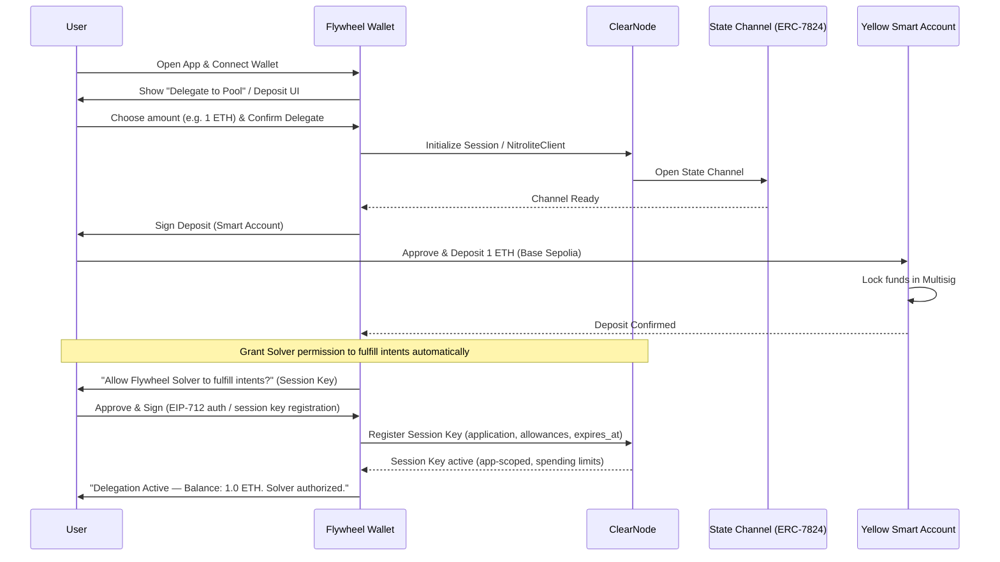
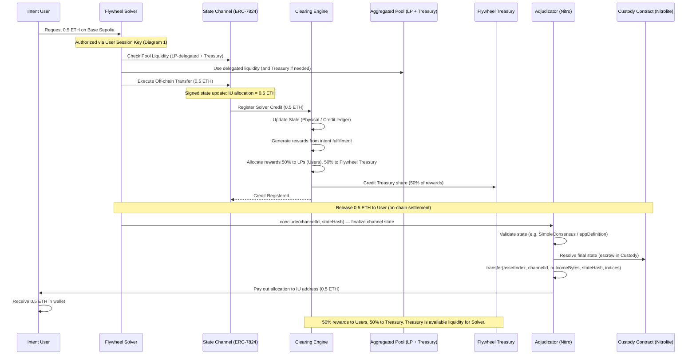
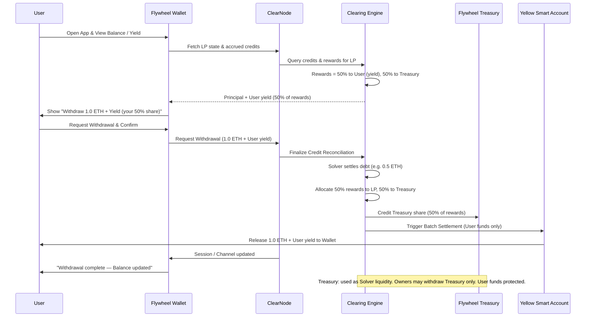

# **Sequence Diagrams: Flywheel — Aggregated Liquidity Pool**

These workflows describe how a **User** uses the Flywheel Wallet to delegate assets to the aggregated pool. The user only interacts with the App to delegate and **grants the Flywheel Solver permission** (via a Session Key) to fulfill intents automatically; the Solver then registers credits and distributes rewards without further user signatures.

**Rewards & Flywheel Treasury:** Intent order fulfillment generates **rewards**. The system distributes them **50% to the User** (LPs) and **50% to the Flywheel Treasury**. The Treasury is part of the **available liquidity** the Solver can use to fulfill intents (together with user-delegated assets). System owners may withdraw Treasury funds; **User funds are always protected** and never used for owner withdrawals.

---

## **1. User Delegates Assets (Deposit & Channel Setup)**

The user interacts with the App to delegate assets only and grants the Flywheel Solver permission to fulfill intents automatically via a **Session Key** (Yellow). The App and infrastructure set up the channel and lock funds.

**Why Session Key (not App Session):** Per Yellow/Nitrolite docs, **Session Keys** let the user **sign once** and grant the app (and thus the Flywheel Solver) limited, app-scoped access with **allowances** and **expires_at**, so the Solver can fulfill intents automatically without a wallet prompt each time. **App Sessions** are for multi-party state (e.g. escrow, DAO) with quorum and weights—they require coordinated signatures for state updates and are not aimed at "user delegates to solver once, solver acts many times."

---

## **2. Flywheel Solver Fulfills Intents & Registers Credits (Automatic)**

No user action. The Flywheel Solver uses the user-granted **Session Key** and the aggregated pool (LP-delegated assets **and** Flywheel Treasury liquidity) to fulfill external intents, register credits, and allocate rewards (50% User, 50% Treasury). Releasing funds to the Intent User uses the Nitrolite Custody Contract and Adjudicator (ERC-7824) for on-chain settlement.

**Release to user (Yellow/Nitrolite):** The Flywheel Solver finalizes the channel state on-chain via the **Adjudicator** (`conclude`). The **Custody Contract** (Nitrolite) holds the escrow; the Adjudicator's `transfer(assetIndex, channelId, outcomeBytes, stateHash, indices)` pays out the Intent User's allocation. Alternatively, `concludeAndTransferAllAssets` can finalize and transfer in one transaction (ERC-7824).

---

## **3. User Withdrawal & Reward Distribution**

The user interacts with the App to withdraw and claim. The Solver's registered credits are reconciled; **rewards from intent fulfillment** are split **50% to the User** (yield) and **50% to the Flywheel Treasury**. The user receives principal plus their 50% share of rewards. Treasury funds can be used by the system as liquidity for the Solver; system owners may withdraw from the Treasury—**User funds are always protected** and never used for owner withdrawals.

