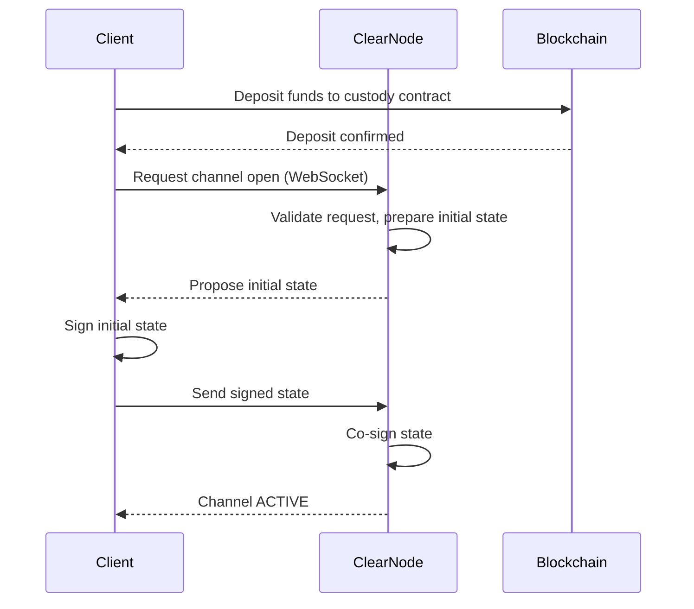
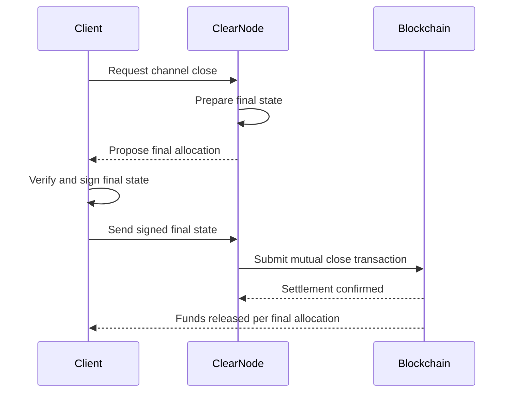
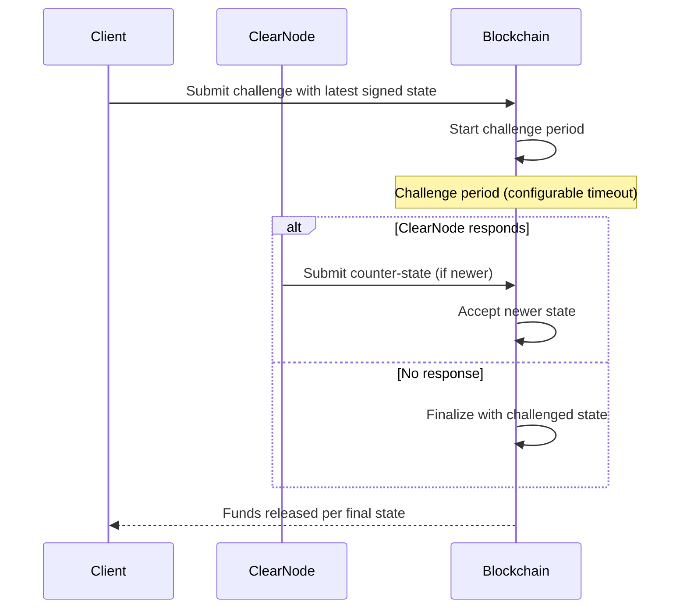

# Architecture & Three-Layer Design

> **Sources**: [MiCA White Paper v1.2](./YELLOW_MiCA_White_Paper_v.1.2.pdf) (Part H), [docs.yellow.org](https://docs.yellow.org/docs/learn/architecture-at-a-glance), [GitHub layer-3/docs - architecture.mdx](https://github.com/layer-3/docs/blob/master/docs/protocol/architecture.mdx)

## Overview

Yellow Network's architecture is built on a **three-layer design** that separates concerns between on-chain security, off-chain performance, and application-level functionality. The blockchain settlement layer provides **trust**, the state channels provide **speed**, and the ClearNodes provide **connectivity**.

```
┌─────────────────────────────────────────────────┐
│              APPLICATION LAYER                    │
│  (dApps, Yellow SDK, NeoDAX, Yellow App Store)   │
├─────────────────────────────────────────────────┤
│              OFF-CHAIN LAYER                      │
│  (ClearNodes, Nitrolite RPC, State Channels)     │
├─────────────────────────────────────────────────┤
│              ON-CHAIN LAYER                       │
│  (Custody Contracts, Adjudicators, ERC-7824)     │
│  Ethereum | Base | Arbitrum | Linea | BNB | ...  │
└─────────────────────────────────────────────────┘
```

## Layer 1: On-Chain Layer

The on-chain layer provides the **foundational settlement and security guarantees**. It consists of smart contracts deployed on supported EVM-compatible blockchains.

### Key Components

| Contract | Purpose |
|----------|---------|
| **IChannel** | State channel management — open, challenge, checkpoint, close |
| **IDeposit** | Asset deposit and withdrawal management |
| **IChannelReader** | Read-only queries for channel state |
| **ERC-7824** | Standard specification for channel arbitration |

### On-Chain Responsibilities

- **Asset custody**: ERC-20 tokens and native assets locked within channels
- **Mutual close procedures**: All parties cooperatively finalize the channel state
- **Challenge-response mechanism**: Unilateral closure and settlement if counterparty is unresponsive
- **Settlement finality**: Dispute resolution and token custody anchored to public blockchain
- **Deposit/withdrawal**: Users deposit funds on-chain to participate in state channels

### Supported Chains

| Chain | Status |
|-------|--------|
| Ethereum | Live |
| Base | Live |
| Arbitrum | Live |
| Linea | Live |
| BNB Chain | Live |
| Polygon | Live |
| Non-EVM chains | Planned (Closed Beta) |

## Layer 2: Off-Chain Layer (ClearNode Network)

The off-chain layer is where the majority of transactions occur. It operates through the **Nitrolite protocol**, a lightweight state-channel framework designed for scalable, low-latency, cost-efficient interactions.

### ClearNode

A **ClearNode** is a decentralized web service node that provides:

- **Chain abstraction**: Routes transactions across multiple blockchain networks
- **Unified balances**: Aggregates assets from multiple chains into a single balance view
- **Liquidity pooling**: Manages pools of funds across networks
- **Off-chain transaction processing**: Handles state updates without touching the blockchain
- **On-chain arbitration**: Interfaces with ERC-7824 contracts when disputes arise

### How ClearNodes Work

Within N-participant state channels, at least one participant is a ClearNode. ClearNodes allow participants to transact across multiple blockchain environments while maintaining a unified transactional view.

**Example**: A user deposits 50 USDC on Ethereum and 50 USDC on Base. The ClearNode exposes a single "unified balance" of 100 USDC. The user can then withdraw on Arbitrum.

### Nitrolite RPC Protocol

Communication between clients and ClearNodes happens via WebSocket connections using the **Nitrolite RPC** protocol:

- **Production endpoint**: `wss://clearnet.yellow.com/ws`
- **Sandbox endpoint**: `wss://clearnet-sandbox.yellow.com/ws`
- **Message format**: Compact JSON arrays `[reqId, method, params, timestamp]`
- **Protocol version**: NitroRPC/0.4 (current, with intents support)

### Off-Chain Consensus

Off-chain transactions are not broadcast to the blockchain. Instead:

1. Each state update is **co-signed by all channel participants**
2. Signed state updates form a shared ledger state synchronized locally
3. Consensus is achieved through **cryptographic co-signing**, not global block production
4. The blockchain is used only when needed for locking assets, settlement, and dispute enforcement

## Layer 3: Application Layer

The application layer provides developer tools and end-user applications built on top of the protocol.

### Yellow SDK

The primary developer toolkit consisting of:

- **Nitrolite RPC API**: High-level interface for rapid integration
- **NitroliteClient library**: Low-level control over state channels and contracts
- **NPM package**: `@erc7824/nitrolite`

### Applications

- **Yellow Wallet**: User-facing wallet application
- **Yellow Smart Account**: Account abstraction implementation
- **NeoDAX**: Turnkey brokerage solution
- **Yellow App Store**: Marketplace for dApps (planned)
- **Custom dApps**: Third-party applications built with the SDK

## Fund Flow Architecture

Funds in the Yellow Network move through distinct states:

```
┌──────────┐    Deposit     ┌───────────┐   Lock into    ┌────────────────┐
│  Wallet  │ ──────────────>│ Available │ ─────────────> │ Channel-Locked │
│ (On-chain)│               │  Balance  │   Channel      │    Balance     │
└──────────┘               └───────────┘               └────────────────┘
                                                              │
                                                    ClearNode aggregates
                                                              │
                                                              v
                                                    ┌─────────────────┐
                                                    │ Unified Balance │
                                                    │ (Cross-chain)   │
                                                    └─────────────────┘
                                                              │
                                                    Allocate to apps
                                                              │
                                                              v
                                                    ┌─────────────────┐
                                                    │  App Sessions   │
                                                    │ (Trading, etc.) │
                                                    └─────────────────┘
```

### Fund States

| State | Description |
|-------|-------------|
| **Wallet** | Funds in user's on-chain wallet (full user control) |
| **Available Balance** | Deposited into the protocol, available for channel creation |
| **Channel-Locked** | Locked in a state channel with a ClearNode |
| **Unified Balance** | Aggregated view across all chains via ClearNode |
| **App Session** | Allocated to a specific application session (trading, gaming, etc.) |

## Channel Operations (Sequence Diagrams)

### Opening a Channel



### Closing a Channel (Cooperative / Mutual Close)



### Closing a Channel (Unilateral / Challenge)



## Multi-Chain Support & Chain Abstraction

Yellow Network provides chain abstraction through ClearNodes, enabling:

1. **Deposit on any supported chain** — Users lock funds on whichever chain they prefer
2. **Unified balance** — ClearNode aggregates deposits across chains
3. **Withdraw on any chain** — Users can exit on a different chain than they entered
4. **Cross-chain settlement** — Trades and transfers settle across chain boundaries
5. **No bridging required** — ClearNode manages liquidity pools across networks

### How It Works

ClearNodes maintain **pools of funds across multiple networks**. When a user deposits on Chain A and withdraws on Chain B, the ClearNode:

1. Accepts the deposit on Chain A (increases its own pool on A)
2. Releases funds from its pool on Chain B
3. Net positions are periodically rebalanced

This eliminates the need for traditional cross-chain bridges, removing bridge-related security risks.

## Comparison with Traditional Architectures

| Feature | CEX | L2 Rollup | Yellow Network |
|---------|-----|-----------|----------------|
| Custody | Custodial | Semi-custodial | Non-custodial |
| Speed | Fast | Medium | Fast (off-chain) |
| Cross-chain | Manual bridges | Limited | Native chain abstraction |
| Settlement | Internal | On L1 | On any supported chain |
| Privacy | Low (KYC) | On-chain visible | Off-chain (only settlement visible) |
| Scalability | Centralized DB | L2 throughput | Millions TPS (state channels) |

## Further Reading

- [03 - Nitrolite Protocol Specification](./03-nitrolite-protocol.md)
- [04 - State Channels Deep Dive](./04-state-channels.md)
- [05 - SDK & Quick Start](./05-sdk-quickstart.md)
