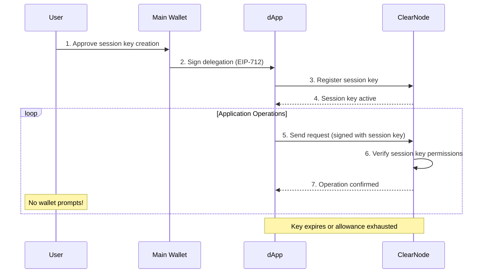

# Security Model & Session Keys

> **Sources**: [MiCA White Paper v1.2](./YELLOW_MiCA_White_Paper_v.1.2.pdf) (Parts H, I), [docs.yellow.org/learn/session-keys](https://docs.yellow.org/docs/learn/session-keys), [docs.yellow.org/protocol/challenge-response](https://docs.yellow.org/docs/protocol/challenge-response), [GitHub layer-3/docs](https://github.com/layer-3/docs)

## Security Overview

Yellow Network's security model operates on multiple layers:

1. **On-chain security** — Smart contracts enforce fund custody, settlement, and dispute resolution
2. **Off-chain security** — Cryptographic co-signing of state updates between participants
3. **Session key delegation** — Controlled permissions for application-level operations
4. **Challenge-response mechanism** — Dispute resolution ensuring honest settlement
5. **Smart contract audits** — Independent third-party security assessments

## Session Keys

### What Are Session Keys?

Session keys are **temporary cryptographic keys** delegated by a user's main wallet. They provide a flexible way to manage security by giving specific permissions and allowances for specific apps — without requiring the user to sign every individual action with their main wallet.

### Key Properties

| Property | Description |
|----------|-------------|
| **Delegation** | Created and authorized by the user's main wallet (EOA or smart account) |
| **Spending limits** | Configurable allowances (max amount per session) |
| **Operation scope** | Restricted to specific operations (transfer, app_session, etc.) |
| **Expiration** | Time-limited (e.g., 1 hour, 24 hours) |
| **Gasless signing** | No wallet prompts during use — seamless UX |

### How Session Keys Work



### Session Key Structure

```typescript
interface SessionKey {
  publicKey: string;           // Session key public address
  allowance: string;           // Max spending amount
  expiration: number;          // Unix timestamp of expiry
  scope: string[];             // Allowed operations
  delegatedBy: string;         // Main wallet address
  signature: string;           // Main wallet's approval signature
}
```

### Creating Session Keys

```typescript
import { generateSessionKey } from '@erc7824/nitrolite';

// Generate a session key with specific permissions
const sessionKey = generateSessionKey({
  allowance: '10000000',           // Max 10 USDC
  expiration: Date.now() + 3600000, // Expires in 1 hour
  scope: ['transfer', 'app_session'], // Allowed operations
});

// Register with ClearNode (requires main wallet signature)
await rpc.registerSessionKey(sessionKey);
```

### Session Key Best Practices

| Practice | Rationale |
|----------|-----------|
| **Set tight allowances** | Limit maximum possible loss if key is compromised |
| **Use short expiration** | Reduce exposure window |
| **Restrict scope** | Only grant permissions needed for the specific application |
| **Rotate regularly** | Create new session keys for each session |
| **Revoke when done** | Explicitly revoke session keys after use |
| **Never store in plain text** | Use secure key storage mechanisms |
| **Monitor usage** | Track session key operations for anomalies |

## Challenge-Response Mechanism

The challenge-response mechanism is the **on-chain security backbone** of state channels. It guarantees that funds can always be recovered, even if the counterparty acts maliciously or goes offline.

### How It Works

1. **Challenge**: A party submits the latest signed state to the on-chain contract
2. **Challenge period**: A timer starts (configurable, typically 24 hours)
3. **Response**: The counterparty can submit a newer signed state during the period
4. **Resolution**: After timeout, the most recent valid state becomes final

### On-Chain Functions

| Function | Purpose |
|----------|---------|
| `Custody.challenge(channelId, state, sigs)` | Start a challenge with the latest known state |
| `Custody.checkpoint(channelId, state, sigs)` | Submit a newer state during challenge period |
| `Custody.close(channelId, state, sigs)` | Finalize after challenge period expires |

### Security Properties

| Property | Guarantee |
|----------|-----------|
| **Latest state wins** | Higher `version` number always takes precedence |
| **Cryptographic proof** | All states signed by all participants |
| **Economic disincentive** | Attempting fraud costs gas and delays settlement |
| **Timeout protection** | All parties get time to respond |
| **Unilateral enforcement** | No cooperation needed from counterparty |

### Challenge Period Configuration

| Duration | Use Case |
|----------|----------|
| 3,600 sec (1 hour) | Fast-moving applications, low-value channels |
| 86,400 sec (24 hours) | **Default** — balanced security and convenience |
| 604,800 sec (7 days) | High-value channels requiring maximum security |

## On-Chain Security Guarantees

### Fund Custody

- Funds are locked in **smart contracts**, not held by any party
- Only the correct final state (signed by all participants) can release funds
- No single party can unilaterally withdraw funds (outside the challenge mechanism)

### Settlement Finality

- On-chain settlement is **final and irreversible**
- Backed by Ethereum's Proof-of-Stake consensus
- Inherits Ethereum's security properties: >$30B staked, thousands of validators

### Smart Contract Enforcement

- Adjudicator contracts validate state transitions
- Invalid states are rejected by the contract
- Fund distribution follows the signed allocation exactly

## Fund Recovery

### Scenario: ClearNode Goes Offline

1. User holds the latest co-signed state
2. User submits `Custody.challenge()` to the blockchain
3. Challenge period begins (e.g., 24 hours)
4. If ClearNode responds, it submits any newer state
5. If ClearNode remains offline, user calls `Custody.close()` after timeout
6. Funds are released per the challenged state

### Scenario: ClearNode Submits Old State

1. ClearNode initiates challenge with an old state (lower version)
2. User observes the challenge event on-chain
3. User submits the newer signed state via `Custody.checkpoint()`
4. Smart contract replaces the old state with the newer one
5. After timeout, funds are released per the newer state

### Key Requirement: Store Latest State

Users **must always store the latest co-signed state**. This is their proof for dispute resolution. Without it, they cannot prove a newer state exists.

## Smart Contract Audits

### Hacken Audit (2024)

| Field | Details |
|-------|---------|
| **Auditor** | Hacken (cybersecurity firm) |
| **Scope** | Ethereum smart contracts for Yellow Network |
| **Year** | 2024 |
| **Methodology** | Likelihood, Impact, Exploitability, and Complexity metrics |
| **Result** | No critical issues found |
| **Report** | https://hacken.io/audits/openware-yellow-network/sca-yellow-network-vault-sept-2024/ |

### Audit Coverage

- Logic correctness
- Exploitability assessment
- Arithmetic safety
- Common attack vectors (reentrancy, overflow, etc.)
- Channel arbitration logic
- Mutual close and challenge-response mechanisms

### Additional Security Partners

| Partner | Role |
|---------|------|
| **Hacken** / **HackenAI** | Smart contract security audits |
| **Zokyo** | Security audits |
| **Cobo** | Custody and treasury management |
| **Fireblocks** | Custody and treasury management |

## Risk Categories & Mitigations

### Technology-Related Risks

| Risk | Description | Mitigation |
|------|-------------|-----------|
| **Smart contract errors** | Defects in Nitrolite contracts (arbitration, close logic, signature verification) | Independent audits by Hacken (2024); no critical vulnerabilities found |
| **Protocol logic defects** | Errors in challenge-response mechanism | Formal verification of dispute logic; extensive testing |
| **Cryptographic risks** | Compromise of signature algorithms; quantum computing advances | Standard EIP-712 signatures; upgradeable protocol design |
| **Infrastructure dependencies** | Single points of failure in ClearNodes, RPC gateways, indexers | Decentralized node network; multiple ClearNode operators |

### Offer-Related Risks

| Risk | Description | Mitigation |
|------|-------------|-----------|
| **Market volatility** | $YELLOW price fluctuation | Treasury Vault with buy-back mechanism; diversified asset portfolio |
| **Liquidity conditions** | Low trading volumes, wide spreads | Multiple exchange listings (Kraken, Coinbase); market making |
| **Funds loss** | Transaction errors, allocation mistakes | 14-day withdrawal right; safeguarded accounts; regulated custodians |
| **Regulatory exposure** | Multi-jurisdiction regulatory changes | MiCA compliance; legal framework; multiple jurisdiction coverage |

### Issuer-Related Risks

| Risk | Description | Mitigation |
|------|-------------|-----------|
| **Operational integrity** | Weaknesses in fraud prevention, error handling | Broker collateral requirements; automated smart contract dispute resolution |
| **Governance practices** | Centralized control, unclear decision-making | Multi-phase decentralized governance framework |
| **Partnership dependencies** | Key partner failures | Broad partner network; no single-provider dependency |

### Crypto-Asset-Related Risks

| Risk | Description | Mitigation |
|------|-------------|-----------|
| **Irreversibility** | Blockchain transactions cannot be undone | Clear user education; confirmation flows |
| **Private key management** | Loss/theft of keys means permanent asset loss | Self-custody model; session key delegation |
| **Custodial risks** | Third-party custody failures | Emphasis on self-custody; regulated custody partners (Cobo, Fireblocks) |
| **Privacy risks** | On-chain activity visible | Off-chain transactions (only settlement on-chain); state channel privacy |
| **Treasury risks** | Decline in network activity | Diversified treasury; governance-driven allocation |

### Project Implementation Risks

| Risk | Description | Mitigation |
|------|-------------|-----------|
| **Technical delays** | Unforeseen issues in development | 33 full-time staff; partnership with Consensys |
| **Operator concentration** | Small group of node operators | Incentive programs for operator diversification |
| **Force majeure** | Blockchain congestion, global infrastructure failures | Multi-chain support; redundant infrastructure |

## Security Architecture Summary

```
┌────────────────────────────────────────────────────────────┐
│                    APPLICATION LAYER                        │
│  Session Keys: Delegated, scoped, time-limited permissions │
├────────────────────────────────────────────────────────────┤
│                    OFF-CHAIN LAYER                          │
│  Cryptographic co-signing: Every state update multi-signed │
│  JWT authentication: EIP-712 challenge-response            │
├────────────────────────────────────────────────────────────┤
│                    ON-CHAIN LAYER                           │
│  Smart contracts: Audited custody and adjudication         │
│  Challenge-response: Dispute resolution with timeouts      │
│  Fund custody: Non-custodial, locked in contracts          │
├────────────────────────────────────────────────────────────┤
│                    BLOCKCHAIN LAYER                         │
│  Ethereum PoS: >$30B staked, thousands of validators       │
│  EVM chains: Base, Arbitrum, Linea, BNB, Polygon           │
└────────────────────────────────────────────────────────────┘
```

## Best Practices for Developers

1. **Always store the latest co-signed state** — This is the user's proof for dispute resolution
2. **Implement session key rotation** — Create new keys for each session, revoke after use
3. **Set appropriate challenge periods** — Balance between security and UX
4. **Monitor on-chain events** — Watch for challenge events to respond promptly
5. **Use the SDK** — Don't roll your own state channel management
6. **Validate all states client-side** — Verify allocations before signing
7. **Implement reconnection logic** — Handle WebSocket disconnections gracefully
8. **Keep session key allowances tight** — Minimize exposure from compromised keys
9. **Use sandbox for testing** — Test all flows on sandbox before production

## Further Reading

- [03 - Nitrolite Protocol](./03-nitrolite-protocol.md)
- [04 - State Channels](./04-state-channels.md)
- [08 - Tokenomics](./08-tokenomics.md)
