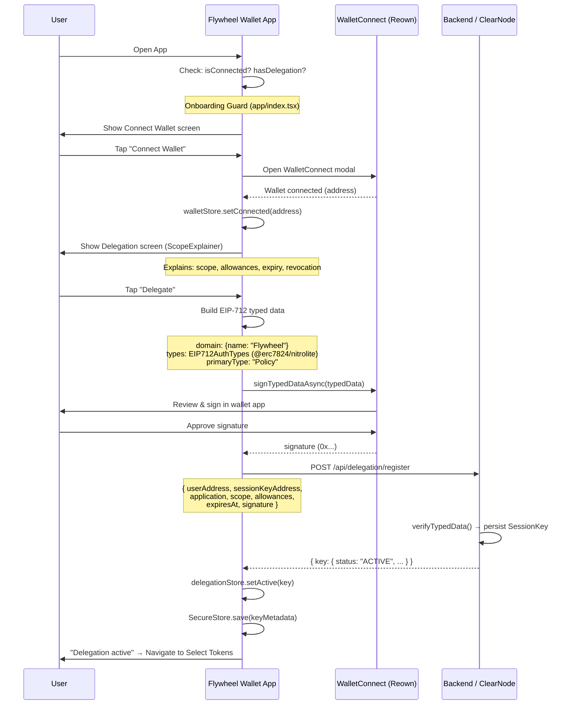
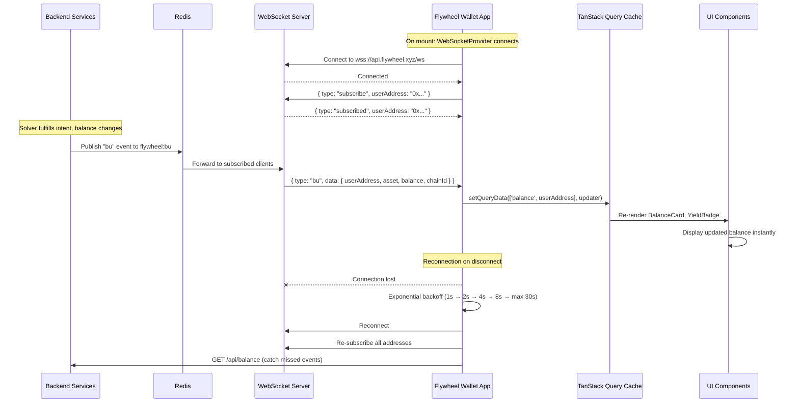
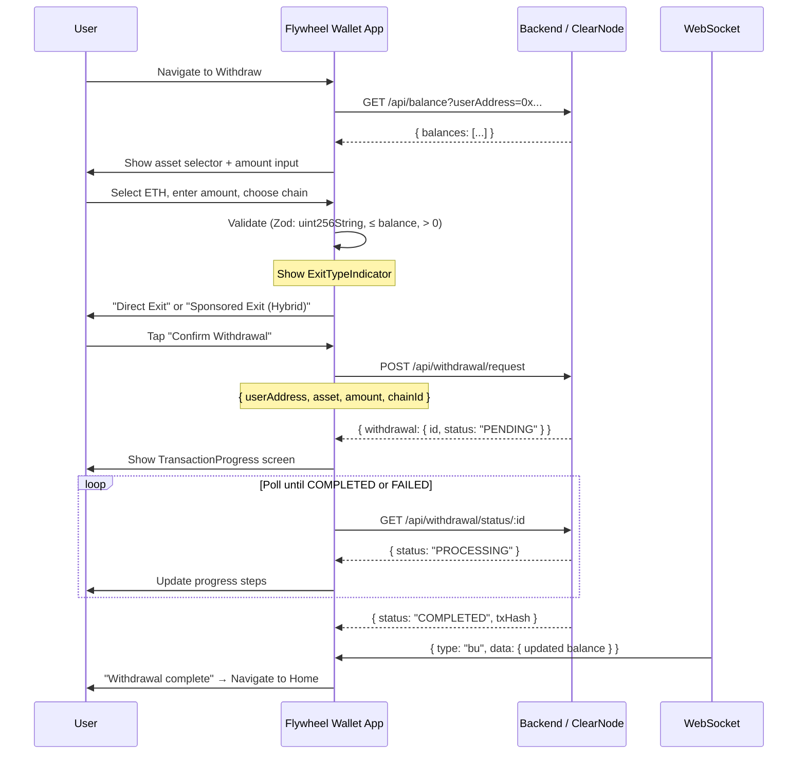
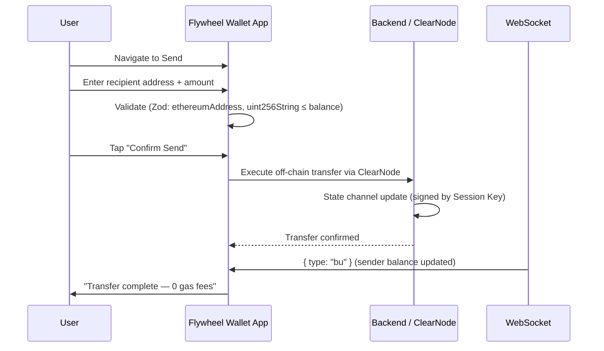
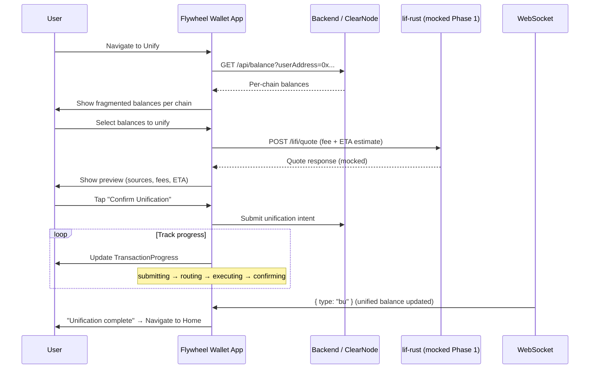
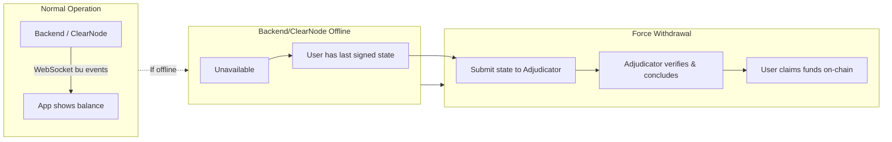

# Flow Diagrams (Frontend Perspective)

Adapted from the canonical source: `../../.context/sequence-diagrams.md`
System architecture diagrams: `../../.context/diagrams.md`

---

## 1. Delegation Flow (US-01 + US-08)

The user connects their wallet, delegates assets, and grants the Flywheel Solver a Session Key. This is the **only wallet signature** required — all subsequent Solver operations are automatic.

---

## 2. Real-Time Balance Updates (US-02 + US-07)

After delegation, balance updates arrive in real-time via WebSocket. The `WebSocketProvider` syncs events directly into the TanStack Query cache.

---

## 3. Withdrawal Flow (US-04)

User requests withdrawal. Backend processes it. The app polls for status updates. Fast Exit Guarantee ensures withdrawal even when local vault is dry.

---

## 4. Send Flow — Gasless L3 P2P (US-05)

Within Yellow L3, transfers are off-chain and gasless via ClearNode.

---

## 5. Unification Flow (US-03 + US-09)

User consolidates fragmented balances from multiple chains into the unified vault. Uses ERC-7683 intents via LiFi (mocked in Phase 1).

---

## 6. Failure Mode & Recovery

If the backend/ClearNode goes offline, the user can recover funds via the on-chain Adjudicator.

**Frontend responsibility:** Display connection status via `ConnectionIndicator`. If disconnected for extended period, show guidance about Force Withdrawal option.
