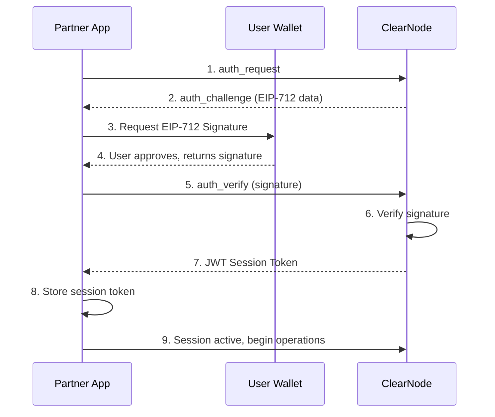
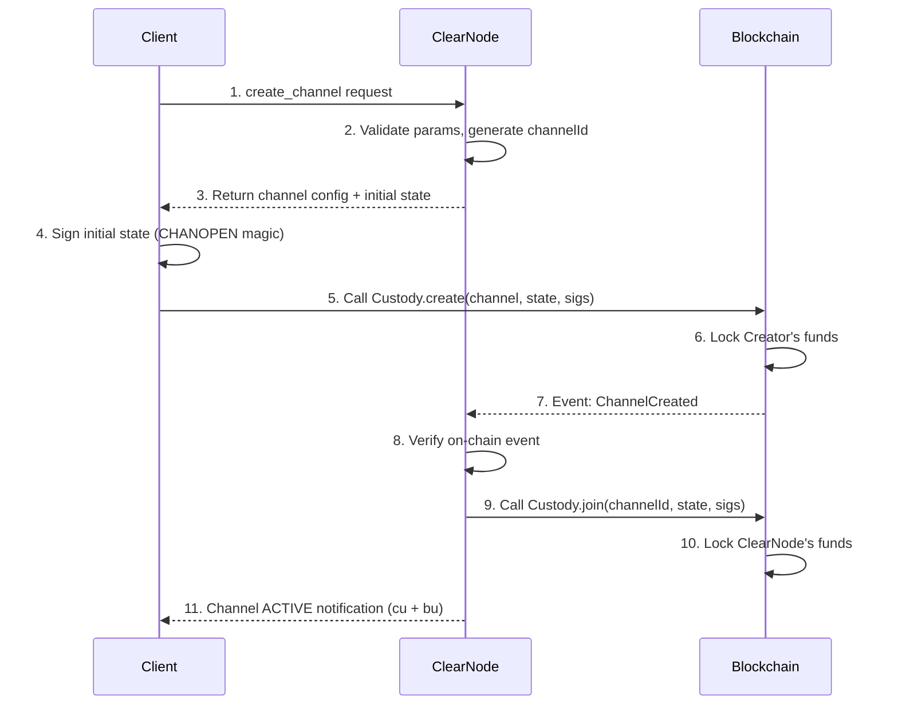
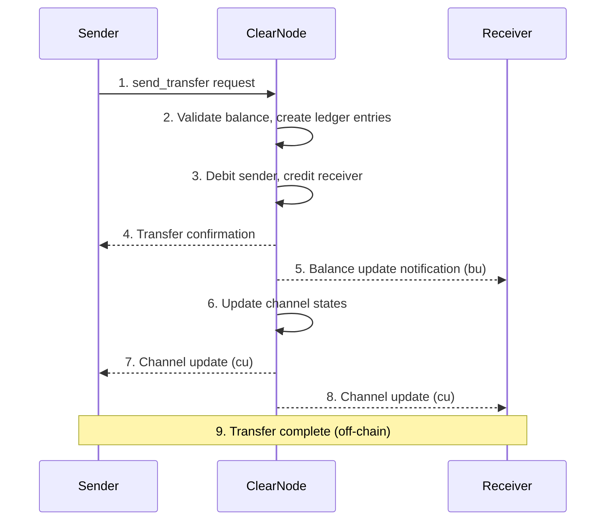
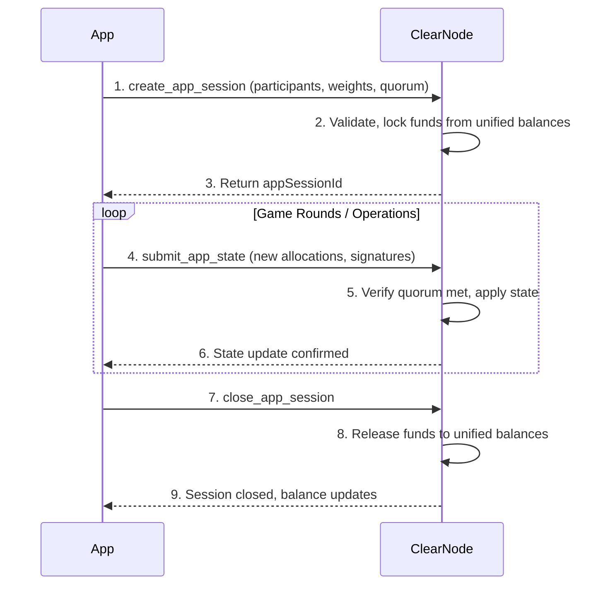
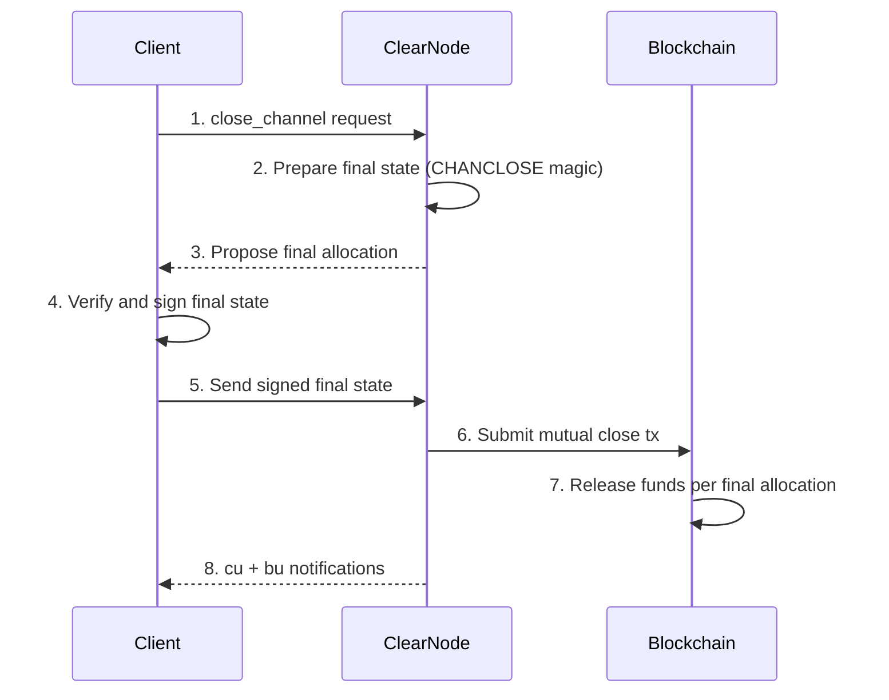
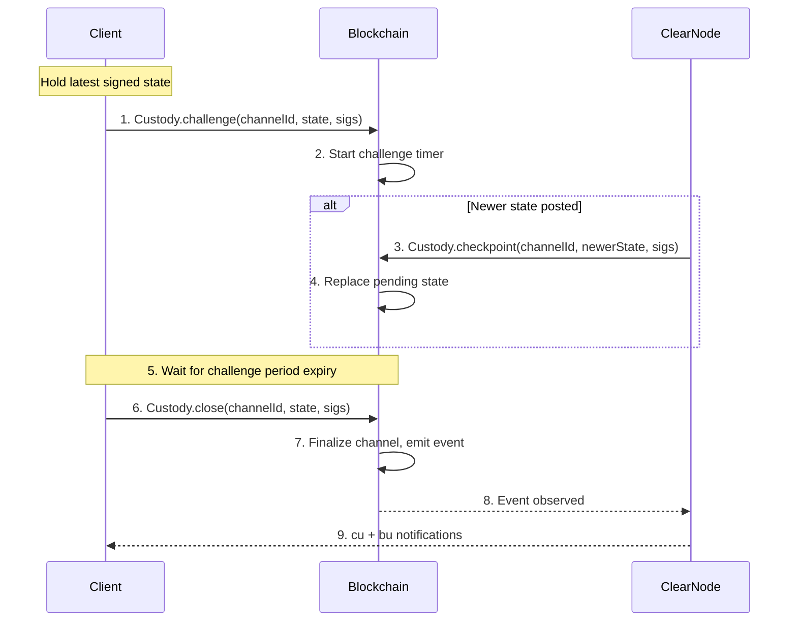

# Nitrolite Protocol Specification

> **Sources**: [MiCA White Paper v1.2](./YELLOW_MiCA_White_Paper_v.1.2.pdf) (Part H), [docs.yellow.org/protocol](https://docs.yellow.org/docs/protocol/introduction), [GitHub layer-3/docs](https://github.com/layer-3/docs) (glossary.mdx, communication-flows.mdx)

## Overview

Nitrolite is a lightweight state-channel framework that enables scalable, low-latency, cost-efficient interactions between network participants. It is the core protocol powering the Yellow Network.

- **On-chain version**: Nitrolite 0.5.0 (Mainnet deployments live)
- **Off-chain protocol**: NitroRPC/0.4 (current, with intents support)
- **Legacy protocol**: NitroRPC/0.2 (basic state updates)
- **Standard**: ERC-7824 specification for channel arbitration
- **GitHub**: https://github.com/erc7824/nitrolite

## Glossary / Terminology

### Core Terms

| Term | Definition |
|------|-----------|
| **Channel** | Secure communication pathway between participants with on-chain fund locking and off-chain state updates |
| **ClearNode** | Decentralized web service providing unified ledger (Nitro RPC) and state channel coordination (Nitrolite) with chain abstraction |
| **Custody Contract** | Main on-chain contract implementing channel creation, joining, closure, and resizing |
| **Adjudicator** | Smart contract validating state transitions according to application-specific rules |
| **State** | Snapshot of the channel at a point in time (intent, version, data, allocations, signatures) |
| **Allocation** | Specification of how funds are distributed: `{ destination, token, amount }` |
| **Unified Balance** | Aggregated view of user funds across multiple chains, managed by a ClearNode |

### Channel Identifiers

**channelId** — Unique 32-byte identifier computed deterministically:

```javascript
channelId = keccak256(abi.encode(
  channel.participants,
  channel.adjudicator,
  channel.challenge,
  channel.nonce
))
```

### Magic Numbers

Constants in `state.data` signaling special states:

| Magic Number | Value | Purpose |
|-------------|-------|---------|
| **CHANOPEN** | 7877 (0x1EC5) | Initial funding state |
| **CHANCLOSE** | 7879 (0x1EC7) | Final closing state |

### Participant Indices

| Index | Role | Description |
|-------|------|-------------|
| 0 | **Creator** | User/client who initiates channel creation |
| 1 | **ClearNode** | Web service node providing chain abstraction |

### Intent Types (NitroRPC/0.4)

| Intent | Purpose |
|--------|---------|
| **INITIALIZE** | Set up initial channel state |
| **OPERATE** | Redistribute existing funds (sum unchanged) |
| **RESIZE** | Modify channel capacity (deposit/withdraw) |
| **FINALIZE** | Close the channel |
| **DEPOSIT** (App Session) | Add funds to session from unified balance |
| **WITHDRAW** (App Session) | Remove funds from session to unified balance |

### Quorum & Weighted Voting

For multi-party app sessions, a **quorum** defines the minimum total weight of signatures required:

```javascript
participants: [Alice, Bob, Judge]
weights:      [40,    40,  50]
quorum:       80

// Valid combinations:
// Alice + Bob   (40 + 40 = 80) ✓
// Alice + Judge (40 + 50 = 90) ✓
// Bob + Judge   (40 + 50 = 90) ✓
// Alice alone   (40 < 80)      ✗
```

## On-Chain Contracts

### Contract Interfaces

| Interface | Methods | Purpose |
|-----------|---------|---------|
| **IChannel** | `create()`, `join()`, `checkpoint()`, `challenge()`, `close()`, `resize()` | Core channel lifecycle |
| **IDeposit** | `deposit()`, `withdraw()` | Fund management |
| **IChannelReader** | `getChannel()`, `getState()` | Read-only state queries |

### Data Structures

#### Channel Configuration

```solidity
struct Channel {
    address[] participants;  // Ordered participant addresses
    address adjudicator;     // State validation contract
    uint256 challenge;       // Challenge period in seconds
    uint256 nonce;           // Uniqueness guarantee (typically timestamp ms)
}
```

#### State

```solidity
struct State {
    uint8 intent;            // INITIALIZE, OPERATE, RESIZE, FINALIZE
    uint256 version;         // Incremental version number
    bytes data;              // Application-specific data or magic number
    Allocation[] allocations; // Fund distribution
}
```

#### Allocation

```solidity
struct Allocation {
    address destination;     // Recipient wallet address
    address token;           // ERC-20 token contract (address(0) for native)
    uint256 amount;          // Amount in smallest unit
}
```

#### packedState (for signing)

```javascript
packedState = abi.encode(
  channelId,
  state.intent,
  state.version,
  state.data,
  state.allocations
)
```

### Adjudicator Examples

- **SimpleConsensus** — Basic consensus adjudicator
- **RemittanceAdjudicator** — Payment-specific adjudicator

## Off-Chain RPC Protocol

### Connection

Communication happens via **WebSocket** connections:

| Environment | Endpoint |
|-------------|----------|
| Production | `wss://clearnet.yellow.com/ws` |
| Sandbox | `wss://clearnet-sandbox.yellow.com/ws` |

### Message Format

All messages use compact JSON arrays:

```
[requestId, method, params, timestamp]
```

| Field | Type | Description |
|-------|------|-------------|
| `requestId` | uint64 | Unique request identifier for correlation |
| `method` | string | RPC method name |
| `params` | array | Method-specific parameters |
| `timestamp` | uint64 | Unix timestamp of the message |

### Signature & Hashing

1. Messages are signed using **EIP-712** typed data signatures
2. The **packedState** is hashed with `keccak256` for on-chain verification
3. All channel participants must co-sign state updates
4. Session keys can be used for delegated signing (see [09-security.md](./09-security.md))

### Protocol Versions

| Version | Features |
|---------|----------|
| **NitroRPC/0.2** | Basic state updates, simple operations |
| **NitroRPC/0.4** | Intent system, dynamic fund management within sessions, DEPOSIT/WITHDRAW intents |

## Communication Flows

### 1. Authentication Flow (9 Steps)



**Steps**:
1. **App → ClearNode**: Send `auth_request` with wallet address
2. **ClearNode → App**: Return `auth_challenge` (EIP-712 typed data)
3. **App → Wallet**: Request signature on challenge
4. **Wallet → User**: Show signature prompt
5. **User → Wallet**: Approve signature
6. **Wallet → App**: Return signed challenge
7. **App → ClearNode**: Send `auth_verify` with signature
8. **ClearNode**: Verify signature, issue JWT session token
9. **Session active**: All subsequent requests include JWT

### 2. Channel Creation Flow (11 Steps)



**Steps**:
1. **Client → ClearNode**: `create_channel` with token, amount, chain preferences
2. **ClearNode**: Validates parameters, constructs channel configuration, computes `channelId`
3. **ClearNode → Client**: Returns channel config and initial funding state
4. **Client**: Signs the initial state (contains `CHANOPEN` magic number 7877)
5. **Client → Blockchain**: Calls `Custody.create()` with channel, initial state, and signature
6. **Blockchain**: Locks Creator's funds in custody contract
7. **Blockchain → ClearNode**: Emits `ChannelCreated` event
8. **ClearNode**: Observes and verifies the on-chain event
9. **ClearNode → Blockchain**: Calls `Custody.join()` to lock its own funds
10. **Blockchain**: Locks ClearNode's funds
11. **ClearNode → Client**: Sends channel update (`cu`) and balance update (`bu`) notifications

### 3. Transfer Flow (9 Steps)



**Steps**:
1. **Sender → ClearNode**: `send_transfer` with recipient, asset, amount
2. **ClearNode**: Validates sender's unified balance is sufficient
3. **ClearNode**: Creates double-entry ledger entries (debit sender, credit receiver)
4. **ClearNode → Sender**: Transfer confirmation response
5. **ClearNode → Receiver**: Balance update (`bu`) notification
6. **ClearNode**: Updates internal channel states for both participants
7. **ClearNode → Sender**: Channel update (`cu`) notification
8. **ClearNode → Receiver**: Channel update (`cu`) notification
9. Transfer complete — entirely off-chain, no blockchain interaction

### 4. App Session Lifecycle Flow



### 5. Cooperative Channel Close Flow



### 6. Challenge-Response Closure Flow

Used when counterparty is unresponsive or disputes the final state.



**Challenge Period**: Typically 24 hours (86400 seconds). Configurable per channel.

## Notification Types

| Notification | Code | Description |
|-------------|------|-------------|
| Channel Update | `cu` | Channel state has changed |
| Balance Update | `bu` | User's unified balance has changed |

## Error Handling

Errors follow standard RPC error format with codes:

| Error Code | Description |
|-----------|-------------|
| -32700 | Parse error |
| -32600 | Invalid request |
| -32601 | Method not found |
| -32602 | Invalid params |
| -32603 | Internal error |

## Further Reading

- [04 - State Channels Deep Dive](./04-state-channels.md)
- [06 - API Reference](./06-api-reference.md)
- [07 - App Sessions](./07-app-sessions.md)
- [09 - Security](./09-security.md)
