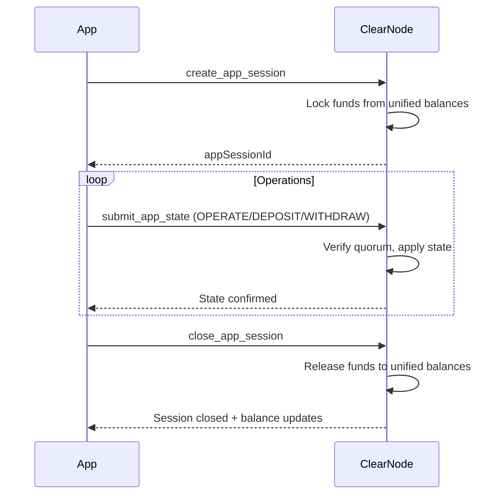

# Multi-Party Application Sessions

> **Sources**: [docs.yellow.org/guides/multi-party-app-sessions](https://docs.yellow.org/docs/guides/multi-party-app-sessions), [GitHub layer-3/docs](https://github.com/layer-3/docs) (glossary.mdx, communication-flows.mdx)

## Overview

**App Sessions** (formerly Virtual Ledger Channels / VLC) are off-chain channels built on top of payment channels. They enable application-specific interactions and transactions between multiple parties without touching the blockchain.

App sessions provide:
- **Multi-party participation** — Beyond the standard 2-party payment channel
- **Custom governance rules** — Configurable quorum and weights
- **Fund locking** — From unified balance, not from on-chain
- **Application-specific state management** — Trading, gaming, escrow, etc.
- **No on-chain transactions** — Entirely off-chain lifecycle

## App Definition Structure

An app session is defined by its **App Definition**, which specifies participants, governance rules, and the protocol:

```typescript
interface AppDefinition {
  protocol: string;         // Adjudicator protocol (e.g., "simple-consensus")
  participants: string[];   // Array of participant wallet addresses
  weights: number[];        // Voting weight per participant
  quorum: number;           // Minimum total weight for valid state updates
}
```

### Example: 3-Party Escrow

```typescript
const appDef = {
  protocol: "simple-consensus",
  participants: [
    "0xBuyer...",    // Buyer
    "0xSeller...",   // Seller
    "0xArbiter..."   // Escrow arbiter
  ],
  weights: [40, 40, 50],
  quorum: 80
};
```

## Allocations

Allocations define how funds are distributed within the session:

```typescript
interface Allocation {
  destination: string;   // Participant wallet address
  token: string;         // Token contract address or symbol
  amount: string;        // Amount in smallest unit (e.g., wei)
}
```

### Initial Allocation Example

```typescript
const allocations = [
  { destination: "0xAlice", token: "usdc", amount: "5000000" },  // 5 USDC
  { destination: "0xBob",   token: "usdc", amount: "5000000" },  // 5 USDC
];
// Total locked: 10 USDC from participants' unified balances
```

## Multi-Party Signatures

State updates in app sessions require signatures meeting the quorum threshold.

### How Signing Works

1. A participant proposes a new state (updated allocations)
2. The proposal is sent to other participants for signing
3. Each signer's weight is added to the total
4. When total weight >= quorum, the state update is valid
5. The signed state is submitted to the ClearNode

### Signature Verification

```javascript
// For each signature, look up the signer's weight
let totalWeight = 0;
for (const sig of signatures) {
  const signer = recoverAddress(stateHash, sig);
  const participantIndex = participants.indexOf(signer);
  totalWeight += weights[participantIndex];
}

// Check quorum
assert(totalWeight >= quorum, "Quorum not met");
```

## Weighted Voting & Quorum

### How Weights Work

Each participant is assigned a **weight** representing their voting power. The **quorum** is the minimum total weight required for a valid state transition.

### Governance Examples

#### 2-Party Equal (Simple Agreement)

```typescript
participants: ["Alice", "Bob"]
weights:      [50, 50]
quorum:       100  // Both must agree
```

#### 2-of-3 Multisig

```typescript
participants: ["Alice", "Bob", "Charlie"]
weights:      [40, 40, 40]
quorum:       80   // Any 2 of 3 must agree
```

#### Weighted Decision (Majority + Arbiter)

```typescript
participants: ["Player1", "Player2", "Referee"]
weights:      [30, 30, 50]
quorum:       80
// Referee + either player = valid
// Both players without referee = 60 < 80 = invalid
```

#### Single Authority (Service Provider)

```typescript
participants: ["User", "ServiceProvider"]
weights:      [0, 100]
quorum:       100
// Only service provider can update state
// User's funds are protected by channel-level security
```

## Session Lifecycle

### 1. Creation

```typescript
// Lock funds from unified balances into the session
const session = await rpc.createAppSession({
  appDefinition: {
    protocol: "simple-consensus",
    participants: ["0xAlice", "0xBob"],
    weights: [50, 50],
    quorum: 100,
  },
  allocations: [
    { destination: "0xAlice", token: "usdc", amount: "5000000" },
    { destination: "0xBob", token: "usdc", amount: "5000000" },
  ],
});
```

### 2. State Updates (OPERATE)

Redistribute funds within the session. The total must remain constant.

```typescript
await rpc.submitAppState({
  appSessionId: session.appSessionId,
  intent: "OPERATE",
  allocations: [
    { destination: "0xAlice", token: "usdc", amount: "7000000" }, // +2 USDC
    { destination: "0xBob", token: "usdc", amount: "3000000" },   // -2 USDC
  ],
  signatures: [aliceSig, bobSig], // Both signed (50 + 50 = 100 >= 100)
});
```

### 3. Deposit (Add Funds)

Add funds from unified balance to an active session.

```typescript
await rpc.submitAppState({
  appSessionId: session.appSessionId,
  intent: "DEPOSIT",
  allocations: [
    { destination: "0xAlice", token: "usdc", amount: "10000000" }, // +5 USDC from balance
    { destination: "0xBob", token: "usdc", amount: "3000000" },
  ],
  signatures: [aliceSig, bobSig],
});
```

### 4. Withdraw (Remove Funds)

Remove funds from session back to unified balance.

```typescript
await rpc.submitAppState({
  appSessionId: session.appSessionId,
  intent: "WITHDRAW",
  allocations: [
    { destination: "0xAlice", token: "usdc", amount: "5000000" }, // -5 USDC to balance
    { destination: "0xBob", token: "usdc", amount: "3000000" },
  ],
  signatures: [aliceSig, bobSig],
});
```

### 5. Close Session

Release all remaining funds back to unified balances.

```typescript
await rpc.closeAppSession({
  appSessionId: session.appSessionId,
});
```

### Lifecycle Diagram



## Use Cases

### 1. Escrow Service

```typescript
// Buyer pays, arbiter holds funds until delivery confirmed
const escrow = {
  participants: ["0xBuyer", "0xSeller", "0xArbiter"],
  weights: [30, 30, 50],
  quorum: 80,
};

// Initial: Buyer locks funds
allocations: [
  { destination: "0xBuyer", token: "usdc", amount: "10000000" },
  { destination: "0xSeller", token: "usdc", amount: "0" },
]

// After delivery: Arbiter + Seller release funds
allocations: [
  { destination: "0xBuyer", token: "usdc", amount: "0" },
  { destination: "0xSeller", token: "usdc", amount: "10000000" },
]
// Signatures: Seller (30) + Arbiter (50) = 80 >= 80 ✓
```

### 2. Real-Time Gaming

```typescript
// Two players enter a match with stakes
const game = {
  participants: ["0xPlayer1", "0xPlayer2", "0xGameServer"],
  weights: [30, 30, 50],
  quorum: 80,
};

// Entry fees locked
allocations: [
  { destination: "0xPlayer1", token: "usdc", amount: "1000000" },
  { destination: "0xPlayer2", token: "usdc", amount: "1000000" },
]

// Game result: Player1 wins
allocations: [
  { destination: "0xPlayer1", token: "usdc", amount: "1900000" }, // Winner
  { destination: "0xPlayer2", token: "usdc", amount: "0" },
  { destination: "0xGameServer", token: "usdc", amount: "100000" }, // Fee
]
// Signatures: GameServer (50) + Player1 (30) = 80 >= 80 ✓
```

### 3. DAO Treasury Management

```typescript
// Multi-sig treasury with weighted voting
const treasury = {
  participants: ["0xMember1", "0xMember2", "0xMember3", "0xMember4"],
  weights: [25, 25, 25, 25],
  quorum: 75, // 3-of-4 required
};
```

### 4. Atomic Swaps

```typescript
// Two parties exchange different tokens
const swap = {
  participants: ["0xPartyA", "0xPartyB"],
  weights: [50, 50],
  quorum: 100, // Both must agree
};

// Initial: Each locks their token
allocations: [
  { destination: "0xPartyA", token: "usdc", amount: "10000000" },
  { destination: "0xPartyB", token: "eth", amount: "5000000000000000" },
]

// After swap
allocations: [
  { destination: "0xPartyA", token: "eth", amount: "5000000000000000" },
  { destination: "0xPartyB", token: "usdc", amount: "10000000" },
]
```

## Troubleshooting

### Common Issues

| Issue | Cause | Solution |
|-------|-------|----------|
| "Quorum not met" | Insufficient signature weights | Collect more signatures to meet quorum threshold |
| "Allocation sum mismatch" | OPERATE intent with changed total | Ensure allocations sum matches previous state for OPERATE |
| "Invalid participant" | Signer not in participants list | Verify all signers are in the app session's participant list |
| "Session not found" | Invalid appSessionId | Check the appSessionId returned from create_app_session |
| "Insufficient balance" | Not enough in unified balance | Deposit more funds to channel before creating session |
| "Session already closed" | Operating on closed session | Create a new session for new operations |

## Best Practices

1. **Design quorum carefully** — Ensure no single participant can unilaterally drain funds (unless intended)
2. **Use the minimum viable quorum** — Too high makes operations difficult; too low reduces security
3. **Include a neutral arbiter** — For adversarial scenarios (escrow, gaming), add a trusted third party
4. **Monitor session state** — Keep track of current allocations to detect anomalies
5. **Close sessions promptly** — Release funds back to unified balance when the application interaction is complete
6. **Handle DEPOSIT/WITHDRAW intents** — Use NitroRPC/0.4 for dynamic fund management within sessions
7. **Validate allocations client-side** — Before signing, verify the proposed allocation is correct

## Further Reading

- [03 - Nitrolite Protocol](./03-nitrolite-protocol.md)
- [05 - SDK Quick Start](./05-sdk-quickstart.md)
- [06 - API Reference](./06-api-reference.md)
- [09 - Security](./09-security.md)
